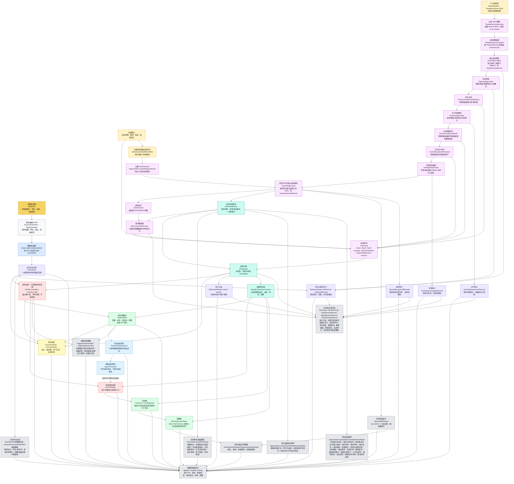
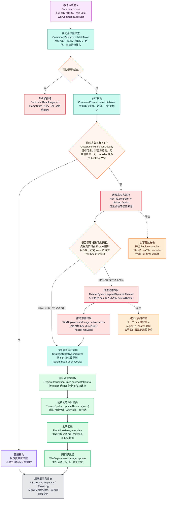
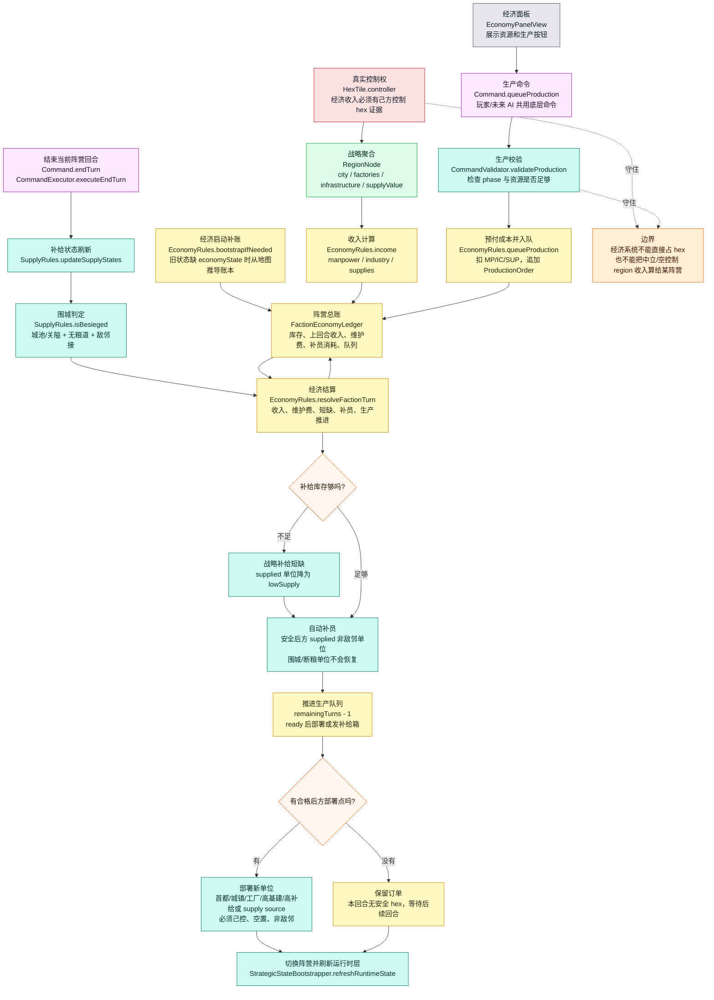
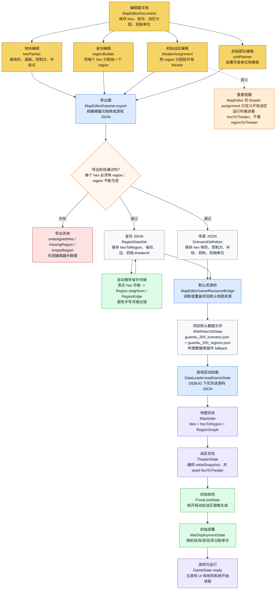
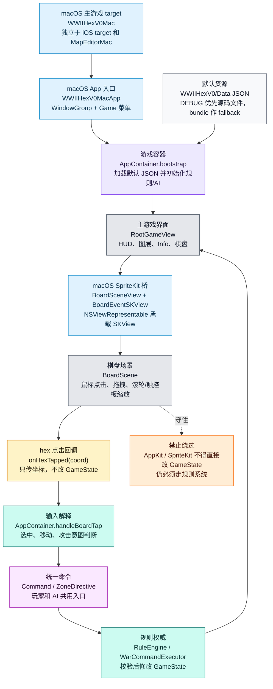
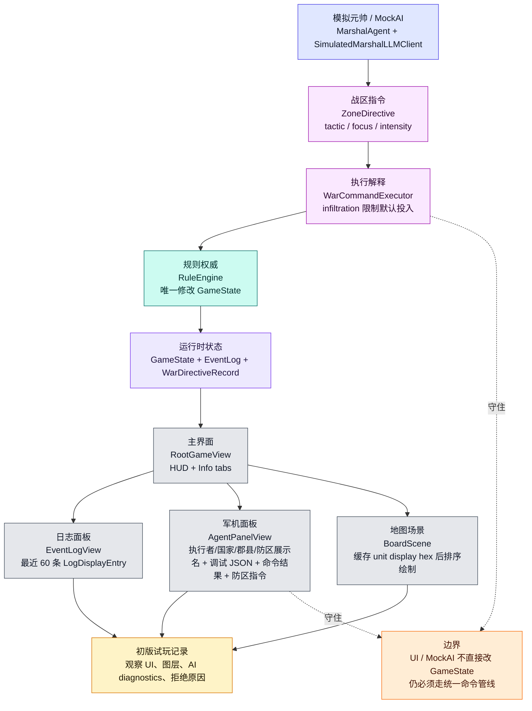
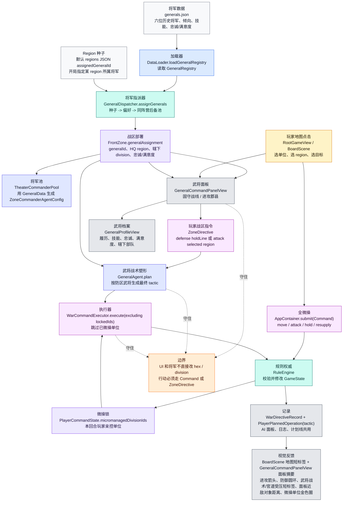
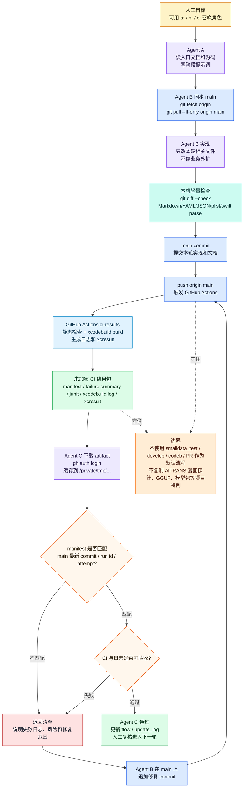

# 三国棋策 Agent Mermaid 核心流程图（v2.4 君主/外交/太守/军师/武将指令编排、外交与太守生产命令、武将战术塑形、道路、粮道和交战兼容层）

> 本图参照 `md/flow/flow.md`。项目正从 `WWIIHexV0` 二战原型迁移到三国题材；v2.4 当前完成官渡默认剧本预览、三国兵种模板兼容层、战术审计显示三国化、围城/粮草最小规则、兵种克制最小规则和君主/外交/太守/军师/武将指令编排、外交与太守生产命令、武将战术塑形、道路、粮道与交战兼容层，图中仍保留 `Division`、`Faction`、`Theater`、`FrontZone` 等代码名，中文解释已按三国迁移口径理解为军队、势力、方面、防区。

## 0. 读图总纲

项目当前最重要的逻辑是：

```text
地图编辑器/JSON 数据
  -> 游戏启动加载为 GameState
  -> hex 是真实战术权威
  -> region / theater / front / deploy 都是从 hex 和军队位置派生出来的战略层
  -> economy 是势力级钱粮总账，收入仍从真实控制的 hex/region 聚合
  -> v2.4 接入官渡默认剧本、三国兵种模板、战术显示、围城/粮草、兵种克制和君主/外交/太守/军师/武将指令编排、外交与太守生产命令、武将战术塑形、道路、粮道与交战
  -> 玩家和 AI 都必须把命令交给 RuleEngine
  -> 命令执行/拒绝原因中文化后再同步刷新战略层和 UI
```

v2.4 命名边界：

- `Faction.germany/allies` 仍是源码和旧 JSON 兼容 rawValue；UI 当前显示为曹操势力 / 袁绍势力。
- 默认新局优先加载 `guandu_200_scenario.json` / `guandu_200_regions.json`；旧阿登数据保留作 fallback。
- 单位模板优先加载 `sanguo_unit_templates.json`；缺文件时才 fallback 到旧 `unit_templates.json`。
- `Faction` 可解码 `cao`、`yuan`、`liuBei`、`sun`、`liuBiao`、`maTeng`、`han`、`neutral`；`Faction.scenarioCases` 给 MapEditor、场景数据和战略派生层控制计算使用。
- 默认 `Faction.activeTurnCases` / 兼容 `Faction.allCases` 仍只枚举当前可行动双方，新增三国势力不参与旧回合循环。
- null / 缺省的 `RegionDataSet` owner/controller 会映射到 `.neutral`，不会再 fallback 给 `.allies`。
- Theater / FrontLine / WarDeployment / Region visibility 派生层会识别 `Faction.scenarioCases` 中的三国势力，不再只看旧二元回合列表。
- `DiplomacyState.initial` 能生成三国基础 country / bloc profile，默认曹袁为 `atWar`，其他新势力默认中立关系。
- 规则、AI 摘要、MockAI 威胁估算和 `WarCommandExecutor` 单位目标筛选中的敌对判断不在新代码里继续依赖二元 `opponent`；攻击合法性、玩家点击/高亮、道路 ZOC、粮道单位阻断、粮道控制格通行、撤退安全格控制格、宏观军令落点敌控优先级、围城邻接、安全补员邻接、部署层敌军存在、相邻敌对防区接触、动态前线敌对接触、ZoneCommanderAgent / MarshalBattlefieldSummarizer / RulerStrategicSnapshot / StrategistBattlefieldSnapshot 单位级 AI hostile 摘要、执行器单位目标筛选和区域交战压力优先使用 `DiplomacyState` 的 hostile / atWar 口径，缺外交建档时 fallback 到 `Faction.isHostile(to:)`。
- `Division` 仍是源码单位类型；UI 当前显示为军队、步卒营、骑兵军、器械营、弓弩营、亲卫营、舟师营。
- `ComponentType` 保留旧 `tank/motorizedInfantry/infantry/artillery` rawValue，并新增 `cavalry/archer/siegeEngine/naval/guard` 给三国模板使用。
- `TacticName` 保留旧 rawValue 作为指令 schema，但 UI / `WarDirectiveRecord` 显示使用正攻、疾袭、突击、破阵、合围、箭雨/器械压制、佯攻、奇袭/袭扰、固守、诱敌/退守、层层设防、死守。
- `SupplyRules.isBesieged` 以城池/关隘、粮道断绝、敌军邻接判定围城；`CombatRules.effectiveDefense` 对围城守军降低有效防御，恢复仍沿用 supplied / 安全后方规则。
- `CombatRules.effectiveAttack` 和 `MovementRules` 已表达骑兵平原优势、困难地形限制、弓弩/器械远程和器械攻城加成；`CombatRules.combatAuditSummary` 会把地形、河流、攻城、围城、死守和侧击等交战因素写成只读审计摘要；`GeneralAgent` 会按武将风格/技能塑形 `ZoneDirective.tactic`，`GeneralSkillDisplay` 会把技能 raw id 中文化展示并提供只读道路/交战效果短提示，`GeneralInfluence` 让武将分配影响道路机动和交战攻防，其中骑兵突击与粮道调度、疾行、甲骑专精共用借郡县官道网络的道路机动触发口径。
- `WarCommandExecutor` 的宏观军令选兵排序和目标郡县候选 hex 可达判断已读取 `MovementRules.effectiveMovementLimit` / `shortestPath`，目标郡县候选和接近候选的敌控格优先级也按 `DiplomacyState` hostile / atWar 判断，让武将官道机动、道路、外交敌对控制格、敌控区、地形和占位影响 AI / 玩家武将宏观军令落点；`CommandExecutor` 会把中文武将姓名、道路机动、交战审计、攻防修正摘要和结算后剩余兵力写入移动、攻击和反击日志；`BoardScene` 会只读 `PlayerCommandState.plannedOperations`，把玩家宏观军令画成源点、目标点、进攻箭头或固守圆环，并显示武将/攻守/短战术、源目锚点官道状态、可见敌军压迫和最近可见敌军短标签；`GeneralCommandPanelView` 会只读显示当前防区道路机动、官道受益军队或无加成原因、可见接敌攻防、当前可见接敌配对、最近可见敌军对象和麾下军队兵力/粮草/军令/行动/官道/接敌状态摘要，也会通过 `AppContainer.selectedGeneralPlannedOperationRows` 在计划军令列表显示武将、最终战术、源→目标、官道状态、源目可见受压和最近可见敌军对象/距离，并通过 `AppContainer.selectedGeneralTargetPreviewNotes` 在提交进攻前显示目标郡县源/目标代表 hex 的官道据守/受压和最近可见敌军距离；武将面板固守/进攻按钮不可用时，`AppContainer` 生成只读原因，`GeneralCommandPanelView` 只展示原因，不改变真实军令执行；`UnitInspectorView` 会通过 `UnitInspectorStrategicState.generalAssignment` 显示选中军队所属武将、风格、忠诚/满意和带短效果提示的中文技能摘要，通过 `AppContainer.selectedUnitMobilityPreviewNotes` 对选中军队显示基础/有效机动、武将官道加成、玩家视角可见可达格数、当前位置官道可见受压或郡县官道状态、本回合可达官道、最近可达/可见安全官道距离、可见安全官道和受可见敌控区压迫的官道格数，通过 `selectedUnitCombatPreviewNotes` 显示最多三名玩家视角可见射程内敌军的首选理由、可见接战官道压制位、首选交战武将、候选敌将、候选武将修正、候选交战审计、预计伤害、结算后敌我剩余兵力、撤退/死守/断粮额外损失/歼灭风险、反击风险、目标地形/城关/官道/粮道/撤退姿态和距离排序；无可见射程内敌军但存在可见敌对军队时显示最近可见敌军、接近候选、候选可达距/可见安全官道/入敌射风险、接近武将、非零接近参考修正、接近态势、接近威胁、需接近格数、可达更近官道位和抵达官道后是否入射程；无可见 hostile 敌军时显示当前无可预判敌对军队空状态；首选目标继续显示武将影响详情，前三个候选目标行各自显示交战审计；`RegionInspectorView` 会显示当前郡县官道覆盖、可见敌军造成的官道受压和最近来源、本郡武将、可见敌军距离/射程/兵力/敌将、当前地格官道状态、可见敌对军队、可见非敌对军队及势力/外交关系/紧张度；这些 UI 只读复用移动/交战/地图派生计算，不执行命令；核心移动、攻击、反击、姿态、回合推进、动态方面事件日志和命令结果/拒绝原因已开始中文化，便于审计“武将做了什么、命令为什么失败”。
- `GeneralData.rank` raw 字段保留数据兼容；`GeneralCommandPanelView` 和 `GeneralProfileView` 使用 `rankDisplayName` 将旧英文 fallback 军衔显示为三国语义军衔，头像辅助功能文案使用中文“头像”。
- `AgentPanelView` 的主审计字段、君主/外交官/太守/军师/武将记录和防区指令摘要优先使用展示名；标题、执行者和命令 fallback 已显示为军机谋议、执行者和军令，外交对象来自 `CountryProfile.name`，郡县来自 `RegionNode.name`，防区来自 `FrontZone.name` 或 `曹军防区：官渡、许昌` 这类只读 fallback，调试 JSON 和 Codable raw id 保持原样。
- `RootGameView` / HUD / macOS 菜单 / `InfoPanelToggle` / `AppContainer.interactionLog` 的玩家可见文本也已中文优先：新开战局、结束回合、军情、军机回合、本地 mock / no-op 来源、兼容 fallback 指挥者名称、基础命令执行/拒绝、武将军令提交/拒绝、规则拒绝摘要、命令条数、手动指挥军队排除、查看/选择军队和选择地格/郡县都显示为三国语义；军队点击日志使用 `Division.thematicDisplayName`，底层命令、记录 id、Codable 和 rawValue 不变。
- Legacy `LocalLLMDecisionProvider` 默认不启用，但 `AgentPromptBuilder` 的提示词已改为三国棋策、武将、官道、粮草和可见交战语义；JSON schema、字段名、命令 rawValue、parser / mapper 和命令执行链保持兼容。
- `MovementRules.isEnemyZoneOfControl`、`SupplyRules` 粮道单位阻断、粮道控制格通行、撤退安全格控制格和围城邻接、`EconomyRules` 安全补员邻接、`WarDeploymentManager` 单位级敌军存在和相邻敌对防区接触、`FrontLineManager` 动态相邻 theater 是否形成敌对前线、Legacy `AgentContextBuilder` 敌军摘要、`MockAICommander.visibleEnemyStrength`、`ZoneCommanderAgent` / `MarshalBattlefieldSummarizer` / `RulerStrategicSnapshot` / `StrategistBattlefieldSnapshot` 单位级 AI hostile 摘要、`CommandValidator` / `RegionCommandValidator` 攻击目标校验、`CommandExecutor.executeAttack` 防绕过 guard、玩家地图点击攻击、可见攻击高亮、武将宏观目标选择、`WarCommandExecutor` 单位敌军强度/存在/目标筛选和宏观军令落点敌控优先级、`RegionCombatRules.pressure`、郡县检查器的可见敌军/非敌对军队分组、官道受压计数和最近来源，`AppContainer` 的军队接战预判、武将麾下/目标/计划军令近敌与受压摘要、移动预览可见敌控过滤和点击日志敌对措辞，以及 `BoardScene` 计划军令地图短标签、部署图层角色 fallback、`CommandPanelView` 状态文案、`GeneralCommandPanelView` 目标预览显示 gate，优先使用 `DiplomacyState` 的 `DiplomaticRelation.status`，缺建档时 fallback 到 `Faction.isHostile(to:)`；objective 和 region controller 来源仍保持 controller / occupation 事实，只在 hostile 分类时使用外交关系；`OccupationRules.canOccupy` 只允许无控制者或外交 hostile / atWar 控制格被自动占领，`WarCommandExecutor` 只把执行前真实可占领的移动作为动态方面突破来源；`MovementRules` 的非同 faction 堆叠阻挡、部署控制权、`FrontLineManager` 的 pressure / supplyImpact / encirclementCandidate 和 `WarDeploymentManager` encirclement 拓扑仍保留原语义；只读预判和高亮还会按玩家视角可见性过滤；中立不会只因不是当前阵营就阻断道路、阻断粮道控制格、阻止撤退安全格、被宏观军令当成敌控优先落点、生成敌对部署接触、生成敌对前线、进入 AI 敌军摘要、影响 MockAI 威胁、被自动占领或成为合法攻击目标。
- `RegionSupplyRules` 的战略郡县粮道控制区通行和撤退安全郡县也使用同一 `DiplomacyState` hostile / atWar 口径；中立、停战、同盟或共同作战 controller 不会仅因旧二元阵营关系阻断战略郡县粮道或战略撤退安全郡县。
- `TurnManager` 在 `.marshalDirective` 和显式 `.zoneDirective` 执行前调用 `RulerAgent.adjust`、`DiplomatAgent.plan`、`GovernorAgent.plan`、`StrategistAgent.plan` 与 `GeneralAgent.plan`；外交提案可转换为 `Command.proposeDiplomacy` 经规则层最小更新关系，太守修路焦点可转换为 `Command.improveRoad` 经规则层连通优先修缮道路，太守生产建议可转换为 `Command.queueProduction` 经规则层排产，武将层会把军令 tactic 收束为合法攻守战术。玩家武将面板宏观命令也会先经 `GeneralAgent.plan` 塑形 tactic，再进入 `WarCommandExecutor -> RuleEngine`，但不会自动结束玩家回合。
- `Region` 显示为郡县，`Theater` 显示为方面，`FrontZone` 显示为防区。
- 正式三国大地图、完整多势力 turn order、真实借道/贡赋/臣属制度和发布级 UI 后续分阶段实现。

图里颜色含义：

- 红色：权威状态，不能被下游反向覆盖。
- 绿色：派生状态，可以重建，但来源必须清楚。
- 蓝色：初始快照/基准状态，不是运行时推进状态。
- 紫色：命令管线，玩家、AI、未来聊天命令都要走这里。

## 1. 总主线：从地图数据到游戏行动

这张图看全局。左上是地图数据怎么进入游戏；中间是 hex、region、theater、front、deploy 的分层关系；右侧是玩家/AI 命令如何统一进入规则系统；底部是 UI 和日志怎么读取结果。



## 2. 占领与动态推进：一个单位移动后发生什么

这张图只看最容易出 bug 的链路：单位移动到敌控空格后，游戏如何占领这个 hex，并且只推进这个 hex 的动态战区和部署归属。

核心原则：占一个 hex，只改这个 hex 的 `hexToTheater` / `hexToFrontZone`；不能把整个 region 的 `regionToTheater` 改掉。



## 3. v0.8 经济、生产与补员链路

这张图看 v0.8 初级经济。经济总账是 faction 级资源池，但收入和部署资格仍回到真实 hex 控制和 region 聚合；生产命令仍走 `RuleEngine`，UI 不直接改 `GameState`。



## 4. AI / 元帅决策链：AI 怎么下命令

这张图看当前默认 AI 主路径。AI 不直接控制单位，也不直接改地图；元帅先读取降维战场摘要，模拟 LLM 输出 `TheaterDirectiveEnvelope` JSON，经 decoder 校验和 compiler 降级后，形成战区级 `DirectiveEnvelope`。v2.4 君主层随后做姿态塑形并写 `RulerDecisionRecord`，外交层读取国家/集团/关系并写 `DiplomatDecisionRecord`，有效外交提案会转换为 `Command.proposeDiplomacy` 经规则层执行，太守层读取经济/郡县/道路/粮草并写 `GovernorDecisionRecord`，修路焦点会转换为 `Command.improveRoad` 经规则层执行，有效生产建议会转换为 `Command.queueProduction` 经规则层执行，军师层再编排目标 region 并写 `StrategistDecisionRecord`，武将层最后复核防区军令、按风格/技能塑形 `ZoneDirective.tactic` 并写 `GeneralDecisionRecord`。底层移动和交战再由 `GeneralInfluence` 读取武将快照做道路机动和攻防修正，`CombatRules.combatAuditSummary` 读取同一套交战 profile 生成因素审计；移动、攻击、反击日志和命令拒绝原因会记录中文可审计摘要，最终仍由 `WarCommandExecutor`、`RuleEngine` 执行。

当前默认 AI 主线是 `MarshalAgent -> TheaterDirective JSON -> TheaterDirectiveDecoder -> TheaterDirectiveCompiler -> RulerAgent.adjust -> DiplomatAgent.plan -> Command.proposeDiplomacy -> GovernorAgent.plan -> Command.improveRoad / Command.queueProduction -> StrategistAgent.plan -> GeneralAgent.plan -> ZoneDirective.tactic shaping -> WarCommandExecutor -> RuleEngine`。旧 v0.37 `TheaterCommanderPool -> ZoneCommanderAgent` 作为 fallback 和显式 `.zoneDirective` 路径保留，这条路径也会在执行前经过君主、外交、太守、军师和武将层。旧 Agent D 管线仍保留，但默认不走。

```mermaid
flowchart TD
    START["触发 AI 行动<br/>AppContainer.advanceOrRunAI / runAIIfNeeded<br/>玩家点下一回合，或命令后轮到 AI"]:::input
    CHECK{"当前阵营该由 AI 控制吗?<br/>德军 AI 阶段一定可跑；盟军只有观察者模式才跑"}:::decision
    STOP["不运行 AI<br/>等待玩家操作或阶段切换"]:::stop
    REFRESH["行动前刷新运行时战略层<br/>StrategicStateBootstrapper.refreshRuntimeState<br/>避免 AI 读到旧前线/旧部署"]:::rules
    TM["AI 回合编排器<br/>TurnManager.runAITurn<br/>默认 pipelineMode = marshalDirective"]:::rules
    SUM["战场摘要<br/>MarshalBattlefieldSummarizer<br/>enemy/strength 按 DiplomacyState hostile<br/>只给元帅 front/deploy/目标/补给摘要，不给全量 hex"]:::ai
    LLM["模拟 LLM 客户端<br/>SimulatedMarshalLLMClient<br/>输出 fenced JSON，不接真实网络或模型"]:::ai
    DEC["元帅 JSON 解码器<br/>TheaterDirectiveDecoder<br/>提取 JSON、解码、校验 schema/zone/region/tactic"]:::command
    COMP["元帅意图编译器<br/>TheaterDirectiveCompiler<br/>TheaterDirective -> ZoneDirective<br/>传递 focus/convergence/coordinated 参数"]:::command
    ENV["指令信封<br/>DirectiveEnvelope<br/>收集编译后的 ZoneDirective"]:::command
    RULER["君主姿态塑形<br/>RulerAgent.adjust<br/>敌对国家和相邻敌军强度按 DiplomacyState<br/>选择进取/守成/合盟/稳固，只调整指令信封"]:::ai
    DIP["君主审计<br/>DiplomacyState.rulerRecords + EventLog<br/>记录姿态、优先防区和理由"]:::ui
    DIPLO["外交提案<br/>DiplomatAgent.plan<br/>同盟/停战/借道/称臣/讨伐檄文"]:::ai
    DCMD["外交命令<br/>Command.proposeDiplomacy<br/>校验国家/关系/提案合法性"]:::command
    DRE["外交规则执行<br/>RuleEngine.execute<br/>更新 DiplomaticRelation 状态/紧张度"]:::rules
    DREC["外交审计<br/>DiplomatDecisionRecord + CommandResultSummary<br/>记录提案、对象、中文执行结果"]:::ui
    GOV["太守内政建议<br/>GovernorAgent.plan<br/>征兵/修路/屯田/治安/补给"]:::ai
    RCMD["太守修路命令<br/>Command.improveRoad<br/>校验控制权/资源并修缮道路"]:::command
    RRE["修路规则执行<br/>RuleEngine.execute<br/>连缀官道、提升基础设施、扣资源"]:::rules
    GCMD["太守生产命令<br/>Command.queueProduction<br/>校验资源并加入生产队列"]:::command
    GRE["生产规则执行<br/>RuleEngine.execute<br/>扣资源、追加 ProductionOrder"]:::rules
    GOVREC["太守审计<br/>GovernorDecisionRecord + CommandResultSummary<br/>记录内政重点、建议和中文执行结果"]:::ui
    STRAT["军师目标编排<br/>StrategistAgent.plan<br/>hostile unit presence 按 DiplomacyState<br/>选择主防区，编排 focus/support/convergence"]:::ai
    SREC["军师审计<br/>StrategistDecisionRecord + EventLog<br/>记录目标 region 和理由"]:::ui
    GENA["武将军令复核与战术塑形<br/>GeneralAgent.plan<br/>读取防区武将，复核投入、预备队和 tactic"]:::ai
    GREC["武将审计<br/>GeneralDecisionRecord + EventLog<br/>记录武将动作、战术、风格和理由"]:::ui
    GINF["武将战场影响与交战审计<br/>GeneralInfluence / CombatAuditSummary<br/>道路机动、攻击、防御与交战因素摘要"]:::rules
    TACTIC["高级战术路由<br/>TacticName<br/>正攻 / 疾袭 / 突击 / 破阵 / 合围 / 箭雨 / 固守 / 死守"]:::command
    WCE["指令执行器<br/>WarCommandExecutor.execute<br/>按战术 profile 选择单位、目标和 fallback"]:::command
    BOTTOM["具体单位命令<br/>Command<br/>attack / move / hold / allowRetreat"]:::command
    RE["统一规则校验执行<br/>RuleEngine<br/>AI 和玩家共用同一套规则"]:::rules
    RECORD["指令复盘记录<br/>WarDirectiveRecord<br/>记录 tactic、target、中文结果和拒绝原因"]:::ui
    END["AI 自动结束回合<br/>RuleEngine.execute(.endTurn)<br/>切换 activeFaction / phase"]:::rules

    START --> CHECK
    CHECK -->|否| STOP
    CHECK -->|是| REFRESH --> TM --> SUM --> LLM --> DEC --> COMP --> ENV
    ENV --> RULER --> DIPLO --> DCMD --> DRE --> GOV --> RCMD --> RRE --> GCMD --> GRE --> STRAT --> GENA --> TACTIC --> WCE --> BOTTOM --> RE --> RECORD --> END
    DRE --> DREC
    RRE --> GOVREC
    GRE --> GOVREC
    GENA --> GINF
    GINF --> WCE
    GINF --> RE
    RULER --> DIP
    DIPLO --> DREC
    GOV --> GOVREC
    STRAT --> SREC
    GENA --> GREC

    FALLBACK["Fallback 将军池<br/>TheaterCommanderPool + ZoneCommanderAgent<br/>visibleEnemyStrengthByRegion 按 DiplomacyState hostile<br/>元帅 JSON 无效或某 zone 无指令时使用"]:::ai
    DEC -.解码失败.-> FALLBACK --> ENV
    COMP -.zone 缺指令.-> FALLBACK

    LEGACY["旧 Agent D 管线<br/>AgentContext -> DecisionProvider -> AgentCommandMapper<br/>只在 legacyAgentOrder 显式分支或测试中使用"]:::legacy
    TM -.默认不走.-> LEGACY

    MANUAL["显式 zoneDirective 路径<br/>TheaterCommanderPool / 手写 ZoneDirective<br/>也可指定 tactic/focus/convergence"]:::input
    MANUAL --> RULER

    classDef input fill:#fef3c7,stroke:#d97706,color:#1f1600
    classDef decision fill:#fff7ed,stroke:#ea580c,color:#1f1300
    classDef stop fill:#fee2e2,stroke:#b91c1c,color:#111827
    classDef rules fill:#ccfbf1,stroke:#0f766e,color:#042f2e
    classDef ai fill:#e0e7ff,stroke:#4f46e5,color:#111827
    classDef command fill:#fae8ff,stroke:#a21caf,color:#2a0a2f
    classDef ui fill:#e5e7eb,stroke:#4b5563,color:#111827
    classDef legacy fill:#f3f4f6,stroke:#6b7280,stroke-dasharray:5 5,color:#111827
```



## 5. MapEditor 到游戏数据：地图怎么进入主游戏

这张图看地图编辑器的输出链路。编辑器里画的是初始地图和初始战区；运行时动态战区仍由游戏里的 `hexToTheater` 推进，不是编辑器脚本控制。



## 6. v1.1 主游戏 macOS 入口

这张图只说明 v1.1 新增的 macOS 主游戏 target。它复用主游戏数据、UI、SpriteKit 棋盘和规则系统；macOS 输入只是平台桥接，不是新的规则入口。



## 7. v1.0 UI / AI / 初版试玩链路

这张图说明 v1.0 分支的收口点：它不新增规则入口，只改善 UI 可读性、AI 回放、轻量性能和试玩记录。



## 8. v0.4 将军与玩家双轨命令

这张图说明 v0.4 分支的新增主线：实体将军从 JSON / region 种子接入 FrontZone；玩家可以微操具体部队，也可以通过将军面板发战区宏观命令。宏观命令会在执行前经过 `GeneralAgent.plan` 塑形最终 tactic，两条路最终仍收口到规则系统。



## 9. 云端迭代与 Agent C 结果包验收

这张图说明当前协作制度：本机只做轻量检查，重验证由 `main` push 后的 GitHub Actions 结果包承接。Agent C 不能只看 Agent B 的文字说明，必须下载并核对最新 `origin/main` run 的 artifact。


