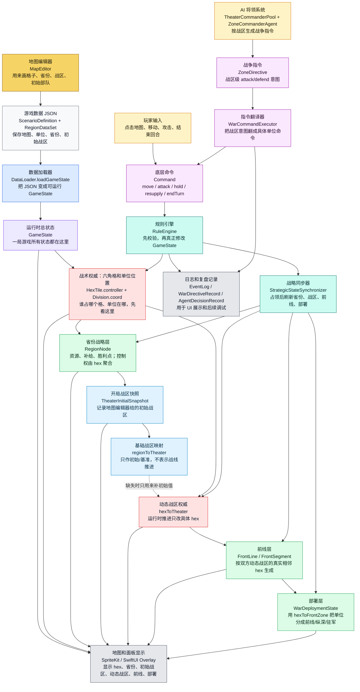
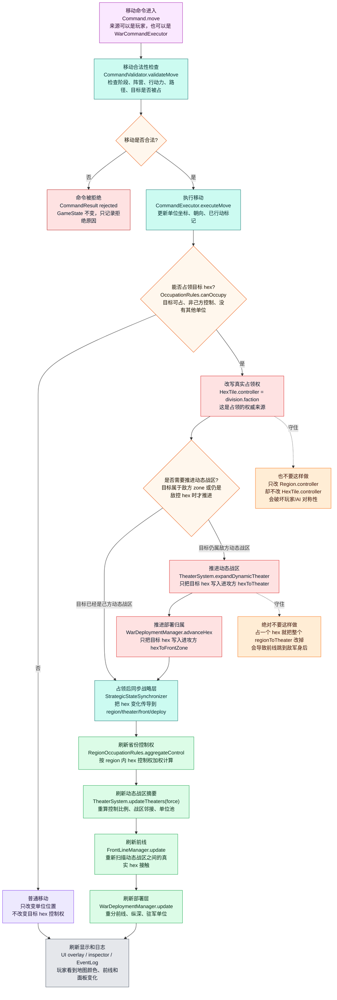
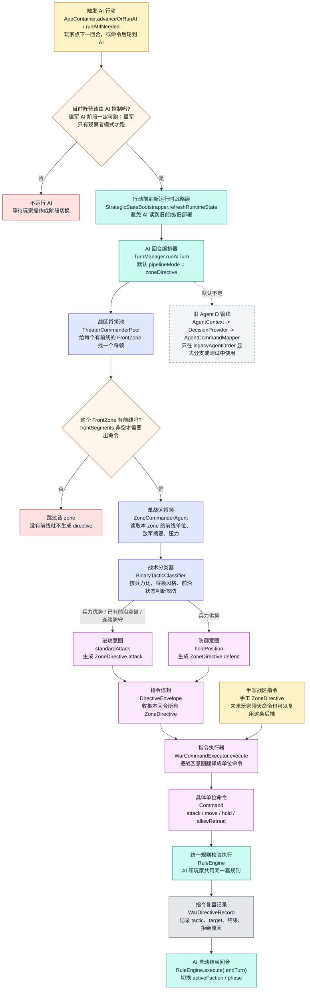
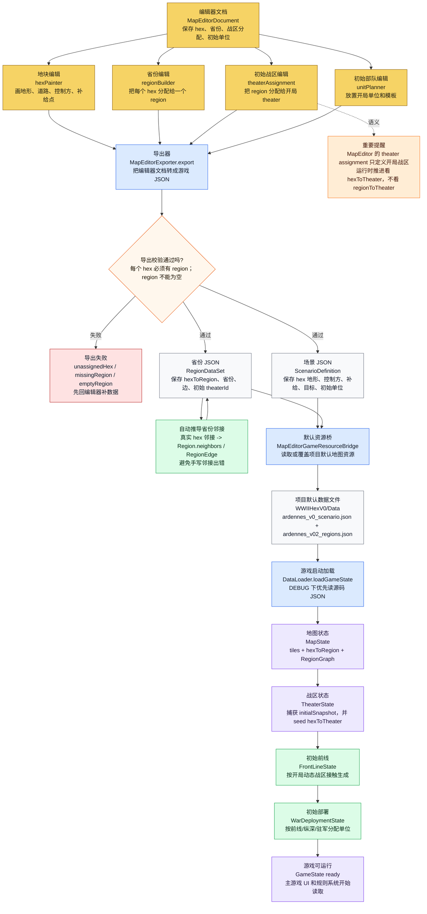

# WWIIHexV0 Mermaid 核心流程图

> 本图参照 `md/flow/flow.md`。每个图块都用“中文解释 + 关键代码名”标注：先看中文理解逻辑，再用代码名回到源码定位。

## 0. 读图总纲

项目当前最重要的逻辑是：

```text
地图编辑器/JSON 数据
  -> 游戏启动加载为 GameState
  -> hex 是真实战术权威
  -> region / theater / front / deploy 都是从 hex 和单位位置派生出来的战略层
  -> 玩家和 AI 都必须把命令交给 RuleEngine
  -> 命令执行后再同步刷新战略层和 UI
```

图里颜色含义：

- 红色：权威状态，不能被下游反向覆盖。
- 绿色：派生状态，可以重建，但来源必须清楚。
- 蓝色：初始快照/基准状态，不是运行时推进状态。
- 紫色：命令管线，玩家、AI、未来聊天命令都要走这里。

## 1. 总主线：从地图数据到游戏行动

这张图看全局。左上是地图数据怎么进入游戏；中间是 hex、region、theater、front、deploy 的分层关系；右侧是玩家/AI 命令如何统一进入规则系统；底部是 UI 和日志怎么读取结果。



## 2. 占领与动态推进：一个单位移动后发生什么

这张图只看最容易出 bug 的链路：单位移动到敌控空格后，游戏如何占领这个 hex，并且只推进这个 hex 的动态战区和部署归属。

核心原则：占一个 hex，只改这个 hex 的 `hexToTheater` / `hexToFrontZone`；不能把整个 region 的 `regionToTheater` 改掉。



## 3. AI / ZoneDirective 管线：AI 怎么下命令

这张图看当前默认 AI 主路径。AI 不直接控制单位，也不直接改地图；AI 先输出战区级 `ZoneDirective`，再由 `WarCommandExecutor` 翻译成底层 `Command`，最后仍然交给 `RuleEngine`。

当前 v0.37 的默认 AI 主线是 `TheaterCommanderPool -> ZoneCommanderAgent -> ZoneDirective -> WarCommandExecutor -> RuleEngine`。旧 Agent D 管线仍保留，但默认不走。



## 4. MapEditor 到游戏数据：地图怎么进入主游戏

这张图看地图编辑器的输出链路。编辑器里画的是初始地图和初始战区；运行时动态战区仍由游戏里的 `hexToTheater` 推进，不是编辑器脚本控制。


